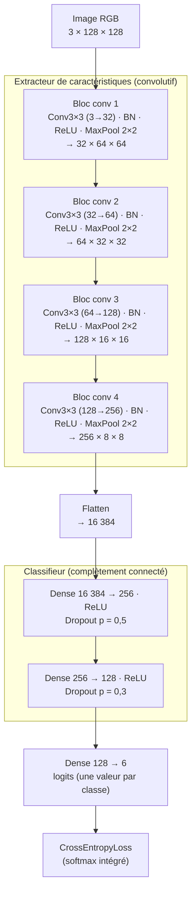
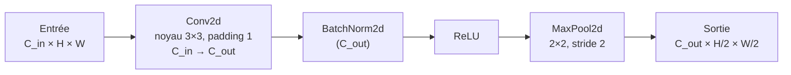
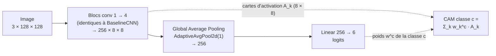
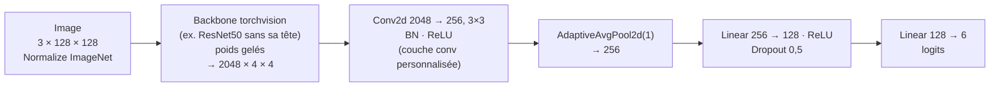

# Architecture du CNN de base (`BaselineCNN`)

Modélisation du réseau convolutif « from scratch » (Q3 du sujet), avant implémentation en PyTorch. Le réseau respecte les éléments minimaux imposés : couches de convolution, pooling, dropout, couches cachées complètement connectées.

Conventions : tenseurs au format PyTorch `(C, H, W)`, entrée `3 × 128 × 128` (décision D2), sortie = **6 logits** (pas de softmax dans le modèle, décision du contrat `src/`).

## 1. Vue d'ensemble

Lecture : la partie convolutive **réduit la résolution spatiale** (128 → 8) tout en **augmentant le nombre de canaux** (3 → 256), c'est-à-dire qu'elle passe de pixels bruts à des caractéristiques de plus en plus abstraites (contours → textures → motifs → parties de scène). Le classifieur combine ensuite ces caractéristiques pour produire un score par classe.

## 2. Détail d'un bloc convolutif

Chaque bloc suit le même motif ; seul le nombre de filtres change.

| Élément | Rôle | Justification du choix |
|---|---|---|
| `Conv2d 3×3, padding 1` | Détecte des motifs locaux ; le padding conserve H × W | Le 3×3 est le noyau standard depuis VGG : peu de paramètres, empilable. |
| `BatchNorm2d` | Normalise les activations par canal | Stabilise et accélère l'entraînement ; permet un learning rate plus élevé. (Élément ajouté, non imposé.) |
| `ReLU` | Non-linéarité | Simple, sans saturation, standard pour les CNN. |
| `MaxPool2d 2×2` | Divise H et W par 2 | Réduit le coût de calcul, apporte une invariance aux petites translations, élargit le champ récepteur. |

## 3. Tableau des couches (formes et paramètres)

| # | Couche | Sortie `(C, H, W)` | Paramètres |
|---|---|---|---|
| 0 | Entrée | 3 × 128 × 128 | — |
| 1 | Conv2d 3→32, 3×3 + BN + ReLU | 32 × 128 × 128 | 896 + 64 |
| 2 | MaxPool 2×2 | 32 × 64 × 64 | 0 |
| 3 | Conv2d 32→64, 3×3 + BN + ReLU | 64 × 64 × 64 | 18 496 + 128 |
| 4 | MaxPool 2×2 | 64 × 32 × 32 | 0 |
| 5 | Conv2d 64→128, 3×3 + BN + ReLU | 128 × 32 × 32 | 73 856 + 256 |
| 6 | MaxPool 2×2 | 128 × 16 × 16 | 0 |
| 7 | Conv2d 128→256, 3×3 + BN + ReLU | 256 × 16 × 16 | 295 168 + 512 |
| 8 | MaxPool 2×2 | 256 × 8 × 8 | 0 |
| 9 | Flatten | 16 384 | 0 |
| 10 | Linear 16 384→256 + ReLU + Dropout 0,5 | 256 | 4 194 560 |
| 11 | Linear 256→128 + ReLU + Dropout 0,3 | 128 | 32 896 |
| 12 | Linear 128→6 (logits) | 6 | 774 |
| | **Total** | | **≈ 4,62 M** (dont ≈ 0,39 M convolutifs, ≈ 4,23 M denses) |

Formules utilisées : `Conv2d : C_in × C_out × k × k + C_out` ; `BatchNorm2d : 2 × C` ; `Linear : n_in × n_out + n_out`.

Observation utile pour la rédaction : plus de 90 % des paramètres sont dans la première couche dense (16 384 → 256). C'est l'endroit où le sur-apprentissage est le plus probable, d'où le dropout à 0,5 juste après. La variante CAM (section 5) supprime cette couche et divise le nombre de paramètres par dix.

## 4. Hyperparamètres exposés (pour `GridSearchCV` via skorch)

Le constructeur de `BaselineCNN` doit rendre ces valeurs paramétrables ; ce sont celles que le lot B fera varier.

| Paramètre du constructeur | Valeur par défaut | Valeurs candidates | Effet |
|---|---|---|---|
| `n_filters` (base, doublée à chaque bloc) | 32 | 16, 32, 64 | Capacité de l'extracteur |
| `fc_units` (première couche dense) | 256 | 128, 256, 512 | Capacité du classifieur |
| `dropout` (première couche dense ; la seconde = `dropout × 0,6`) | 0,5 | 0,3, 0,5 | Régularisation |
| `use_batchnorm` | `True` | `True`, `False` | Comparaison A-14 |
| `lr` (paramètre skorch, pas du module) | 1e-3 | 1e-4, 1e-3, 1e-2 | Vitesse de convergence |
| `batch_size` (skorch) | 64 | 32, 64 | Bruit du gradient / mémoire |

Recommandation pour la grille : 2 à 3 paramètres à la fois (ex. `lr × dropout × n_filters`, 3 × 2 × 2 = 12 combinaisons, `cv=3` → 36 entraînements courts).

## 5. Variante CAM (`CamCNN`, Bonus 1)

Même extracteur, mais le classifieur est remplacé par un *Global Average Pooling* suivi d'une seule couche linéaire : c'est la contrainte de structure exigée par la méthode CAM (Zhou et al., 2016).

| | `BaselineCNN` | `CamCNN` |
|---|---|---|
| Après les convolutions | Flatten → 2 couches denses cachées | GAP → couche de sortie directe |
| Paramètres | ≈ 4,62 M | ≈ 0,39 M |
| Carte d'activation de classe | Grad-CAM uniquement (Bonus 2) | CAM directe (Bonus 1) et Grad-CAM |
| Conformité Q3 (couches cachées denses) | Oui | Non — modèle dédié au bonus |

## 6. Variante avec modèle pré-entraîné (`build_pretrained`, Q9)

Seules les couches ajoutées (conv personnalisée + denses) sont entraînées en phase 1 ; les derniers blocs du backbone peuvent être dégelés en phase 2 (fine-tuning, faible learning rate).

## 7. Produire la figure pour le notebook

- Ce fichier (Mermaid) est rendu directement par GitHub ; pour le notebook, exporter le schéma en PNG depuis https://mermaid.live (menu *Actions → PNG*) et l'insérer dans une cellule Markdown.
- Après implémentation, compléter par la sortie de `torchinfo.summary(model, input_size=(1, 3, 128, 128))`, qui confirme les formes et le nombre de paramètres du tableau ci-dessus.
